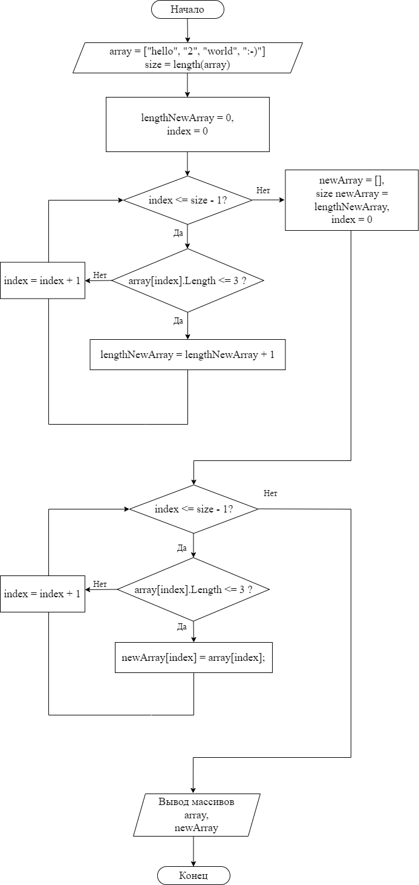
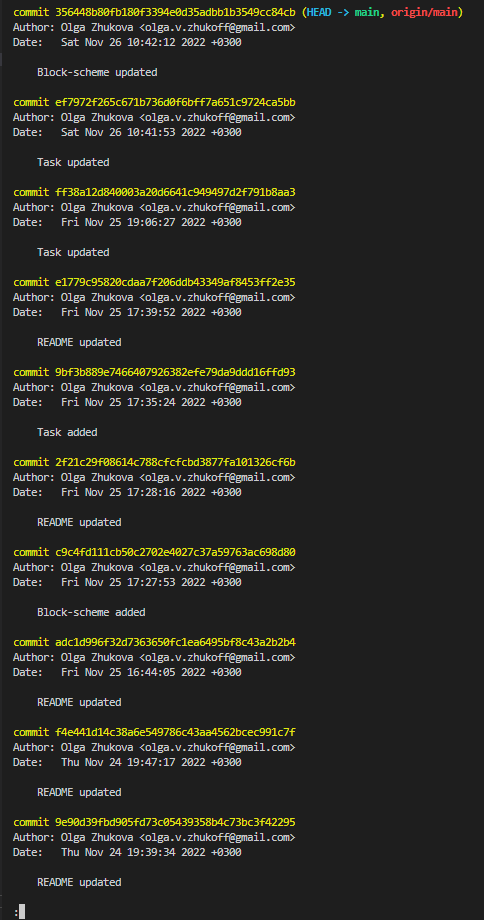

# **ИТОГОВАЯ ПРОВЕРОЧНАЯ РАБОТА** (Общий блок) #

# **Условия:** #

Задача алгоритмически не самая сложная, однако для полноценного выполнения проверочной работы необходимо:

1. Создать репозиторий на GitHub.
2. Нарисовать блок-схему алгоритма (можно обойтись блок-схемой основной содержательной части, если вы выделяете её в отдельный метод).
3. Снабдить репозиторий оформленным текстовым описанием решения (файл README.md).
4. Написать программу, решающую поставленную задачу.
5. Использовать контроль версий в работе над этим небольшим проектом (не должно быть так, что всё залито одним коммитом, как минимум этапы 2, 3, и 4 должны быть расположены в разных коммитах).

# **Задача:** #

Написать программу, которая из имеющегося массива строк формирует массив из строк, длина которых меньше, либо равна 3 символам. Первоначальный массив можно ввести с клавиатуры, либо задать на старте выполнения алгоритма. При решении не рекомендуется пользоваться коллекциями, лучше обойтись исключительно массивами.

*Примеры:*

    ["hello", "2", "world", ":-)"] -> ["2", ":-)"]
    ["1234", "1567", "-2", "computer science"] -> ["-2"]
    ["Russia", "Denmark", "Kazan"] -> []

---
## **Текстовое описание решения:** ##

1. На GitHub создан репозиторий "Control_test".
2. Блок-схема решения поставленной задачи выглядит следующим образом:

3. Сделано: данный репозиторий снабжен оформленным текстовым описанием решения (в данном файле README.md).

4. Программа, решающая задачу написана, и находится в ветке [main](https://github.com/OlgaVZhukova/Control_test/blob/main/Task/Program.cs).

5. Контроль версий был использован при работе над данным проектом, скриншот большей части коммитов:

